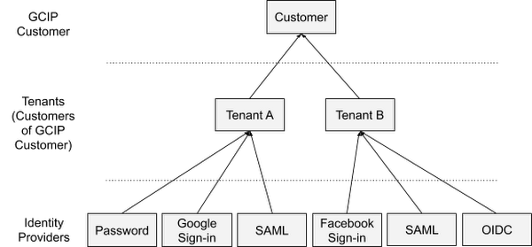

# google-idp-tenant

This service uses the google identity platform for multi-tenant user management and authentication.



## Google Identity Platform REST APIs
- [Tenant API](https://cloud.google.com/identity-platform/docs/reference/rest/v2/projects.tenants)
- [Tenant Account API](https://cloud.google.com/identity-platform/docs/reference/rest/v1/projects.tenants)
- [Account](https://cloud.google.com/identity-platform/docs/reference/rest/v1/accounts)

### GCP Credential
- Service Account Roles
  - Firebase Admin SDK Administrator Service Agent
  - Service Account Token Creator
  - Identity Platform Admini

- Set Credential into environment variable
```bash
export GOOGLE_APPLICATION_CREDENTIALS={your-service-account-key.json}
```


## google-idp-tenant Project
### Dev tools
- Java 11
- Gradle

### Build & Run Project
- build
```bash
./gradlew clean build
```

- Run
```bash
# run app by using Gradle
./gradlew bootRun

# run app by using Jar
java -jar build/libs/google-idp-tenant-0.0.1.jar
```

### APIs & doc
- Swagger doc: http://localhost:8080/swagger-ui/index.html#/
